# The Complete etcd Mental Model: Architecture, Internals & Learning Strategy

> A deep-dive guide for engineers new to the `etcd` repository. Every concept maps directly to real Go packages, structs, and code paths. All diagrams are rendered with [Mermaid](https://mermaid.js.org/).

---

## Table of Contents

1. [What is etcd?](#1-what-is-etcd)
2. [Go Workspace & Module Layout](#2-go-workspace--module-layout)
3. [The Big Picture: Write Flow](#3-the-big-picture-write-flow)
4. [Startup & Bootstrap](#4-startup--bootstrap)
5. [Raft: The Consensus Engine](#5-raft-the-consensus-engine)
6. [WAL: Write-Ahead Log](#6-wal-write-ahead-log)
7. [MVCC & the Storage Engine](#7-mvcc--the-storage-engine)
8. [BoltDB Backend & Batching](#8-boltdb-backend--batching)
9. [Leases](#9-leases)
10. [Watches](#10-watches)
11. [Compaction](#11-compaction)
12. [Authentication & RBAC](#12-authentication--rbac)
13. [Cluster Membership & ConfChange](#13-cluster-membership--confchange)
14. [Corruption Detection](#14-corruption-detection)
15. [Fan-Out Learning Strategy](#15-fan-out-learning-strategy)

---

## 1. What is etcd?

Imagine a bank with three branch managers. To keep things safe, each manager has a copy of the bank's master ledger. To prevent fraud:

1. They must **agree** on every deposit or withdrawal before updating their ledger.
2. If one manager goes offline, the other two can still agree (majority/quorum).
3. If a customer asks any manager for their balance, that manager must ensure they give **current** information, not stale.

**etcd is that shared, consistent ledger.**

| Property                | Description                                                        |
| ----------------------- | ------------------------------------------------------------------ |
| **Distributed**         | Data is replicated across multiple nodes via the Raft protocol     |
| **Strongly consistent** | Every read returns the most recent committed write, or an error    |
| **Highly available**    | Survives the failure of `(N-1)/2` nodes in an N-node cluster       |
| **Watch-able**          | Clients can stream real-time change notifications on any key range |
| **Transactional**       | Multi-key Compare-and-Swap (CAS) transactions are atomic           |

etcd is used primarily by **Kubernetes** to store all cluster state: which pods are scheduled where, which services exist, what secrets and config maps are present.

---

## 2. Go Workspace & Module Layout

The repository uses a **Go workspace** (`go.work`) to manage multiple, independently versioned Go modules. Understanding this layout is essential before reading any code.

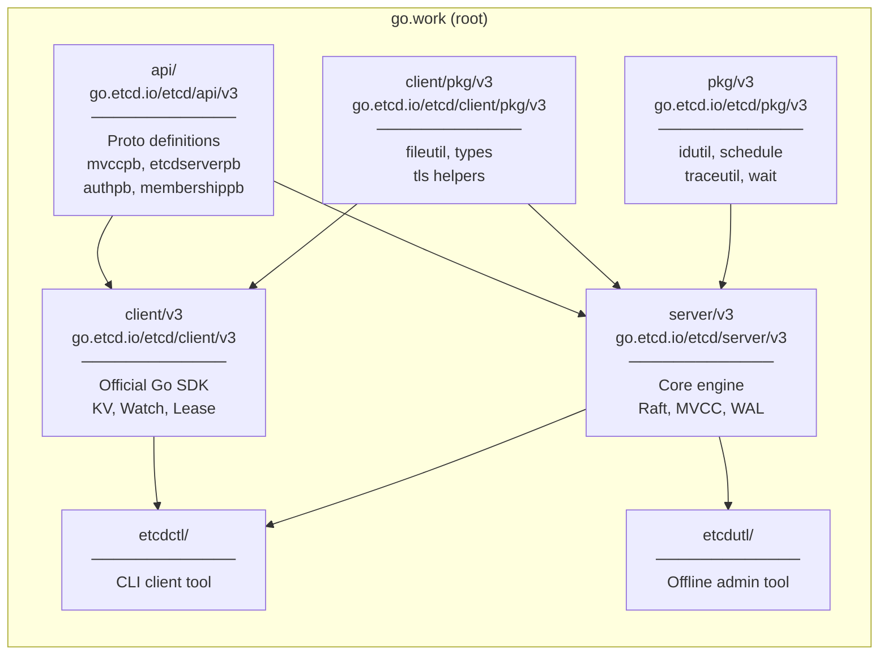

### Key Directories Inside `server/v3`

| Package path                  | Responsibility                                      |
| ----------------------------- | --------------------------------------------------- |
| `etcdserver/`                 | Main server orchestrator, applies Raft commits      |
| `etcdserver/apply/`           | Unmarshals committed entries, dispatches to storage |
| `etcdserver/txn/`             | Individual Put / Range / Delete / Txn logic         |
| `etcdserver/api/rafthttp/`    | HTTP/2 transport for Raft peer messages             |
| `etcdserver/api/membership/`  | Cluster topology, learner nodes, ConfChange         |
| `etcdserver/api/snap/`        | Snapshot save/restore to `.snap` files              |
| `etcdserver/api/v3compactor/` | Periodic & revision-based auto-compaction           |
| `storage/wal/`                | Append-only Write-Ahead Log                         |
| `storage/backend/`            | BoltDB wrapper with batched transaction scheduling  |
| `storage/mvcc/`               | Multi-version key store on top of BoltDB            |
| `lease/`                      | Lease grant, keepalive, expiry engine               |
| `auth/`                       | RBAC user/role management, JWT/simple token         |
| `embed/`                      | `Etcd` struct — embeds a full etcd node in-process  |

---

## 3. The Big Picture: Write Flow

When a client calls `Put("foo", "bar")`, the request travels through every layer of the stack:

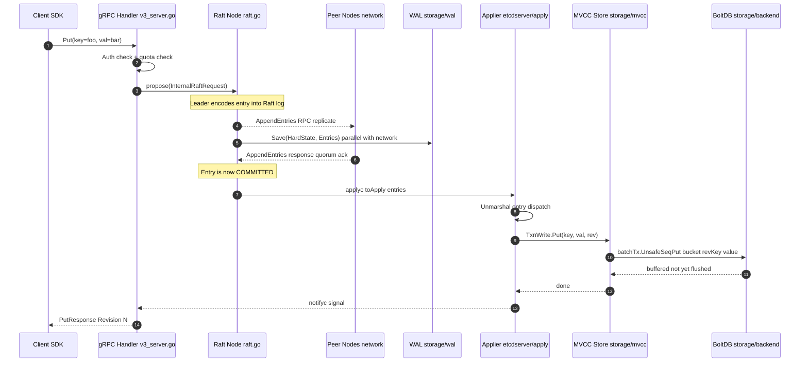

### Step-by-Step Breakdown

1. **Auth & Quota** — [`v3_server.go`](server/etcdserver/v3_server.go) intercepts the gRPC call, validates the auth token and checks if the backend quota is exceeded.
2. **Raft Proposal** — The server wraps the request in an `InternalRaftRequest` proto and proposes it to the local Raft node via `node.Propose()`.
3. **Replication** — The Raft leader sends `AppendEntries` RPCs to all follower peers via [`rafthttp/transport.go`](server/etcdserver/api/rafthttp/transport.go).
4. **WAL Write** — The leader writes the entry to its own WAL **in parallel** with the network round-trip (see §5).
5. **Commit** — Once a quorum of nodes acknowledge, the entry is marked **committed** in the Raft log.
6. **Apply Loop** — [`server.go`](server/etcdserver/server.go) reads from the `applyc` channel and calls the Applier chain.
7. **MVCC Write** — The MVCC store assigns a monotonically increasing **Revision** and stores the key-value pair in BoltDB under that revision key.
8. **Response** — The gRPC handler was waiting on a `wait.Wait` channel keyed to the proposal ID; once applied, it is woken up and returns success.

---

## 4. Startup & Bootstrap

Before etcd can serve traffic, it must reconstruct its state from disk. The [`bootstrap.go`](server/etcdserver/bootstrap.go) function handles all startup paths.

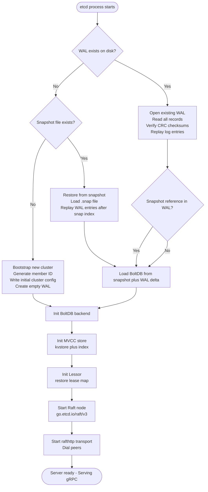

### What `bootstrap.go` Actually Does

- **`haveWAL := wal.Exist(cfg.WALDir())`** — single boolean that selects the startup path.
- **`bootstrapBackend()`** — opens or creates the BoltDB file, sets up the `backend.Backend` with batch interval (`100ms`, limit `10000`).
- **`bootstrapSnapshot()`** — loads the most recent `.snap` file to get the last committed state machine snapshot.
- After reconstruction, `NewServer()` in [`server.go`](server/etcdserver/server.go) wires everything together: the Raft node, MVCC store, Lessor, Auth store, and gRPC server.

---

## 5. Raft: The Consensus Engine

etcd delegates all consensus to the external library `go.etcd.io/raft/v3`. The bridge between etcd and this library is [`raft.go`](server/etcdserver/raft.go), which runs a dedicated goroutine consuming the `Ready()` channel.

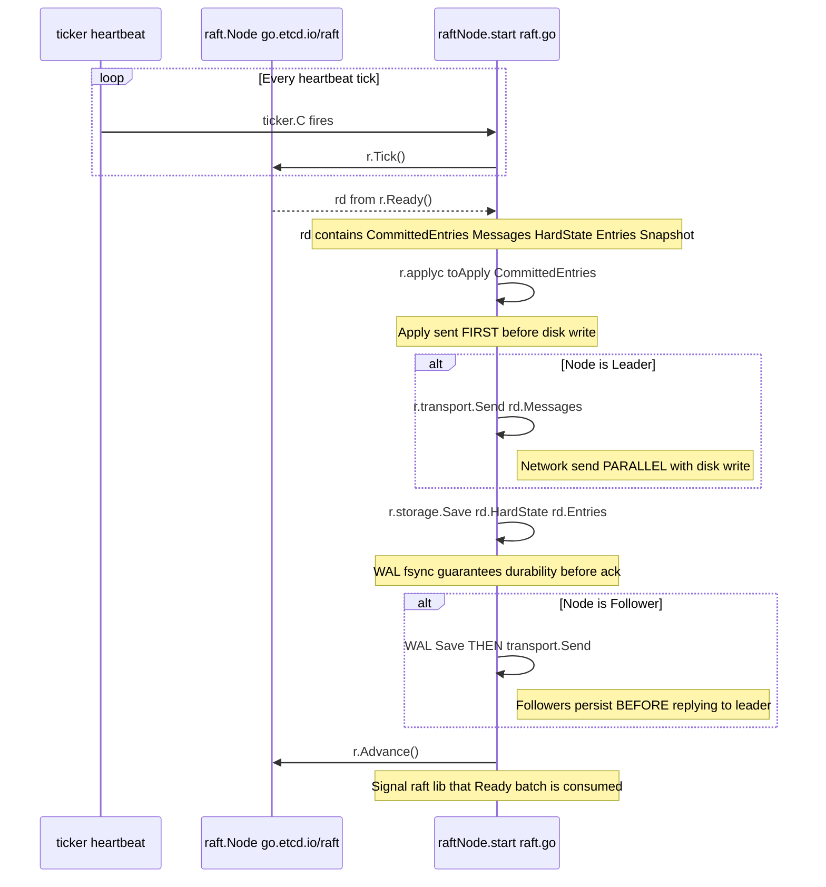

### The Leader Parallelism Optimization

The critical optimization at [`raft.go:240-258`](server/etcdserver/raft.go#L240-L258):

- **Leader**: sends `rd.Messages` to peers **and** saves to WAL **concurrently**. Network RTT and disk I/O overlap — reducing commit latency significantly.
- **Follower**: must `Save()` to WAL and `fsync` **before** sending any reply to the leader. This prevents the follower from acknowledging an entry it hasn't persisted, which would risk data loss on a crash.

This asymmetry is the key reason why etcd can achieve both **low latency** and **strict durability**.

---

## 6. WAL: Write-Ahead Log

The WAL lives in `storage/wal/`. It is an **append-only journal** segmented into fixed-size files (default 64MB each). Every `HardState`, `Entry`, `Snapshot`, and `CRC` record is written as a framed protobuf record.

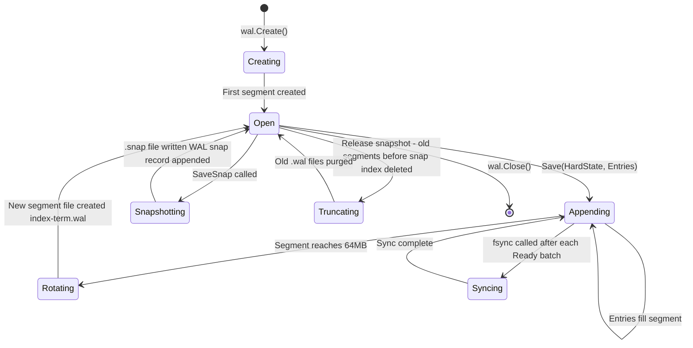

### WAL Record Types

| Record Type    | When Written       | Purpose                                              |
| -------------- | ------------------ | ---------------------------------------------------- |
| `metadataType` | Once at creation   | Cluster metadata, node ID                            |
| `entryType`    | Every `Save()`     | Raw Raft log entries (the actual proposals)          |
| `stateType`    | Every `Save()`     | HardState: `{Term, Vote, Commit}` — survives crashes |
| `snapshotType` | Every `SaveSnap()` | Marks the snapshot boundary for truncation           |
| `crcType`      | Segment header     | CRC32 checksum — detected by `repair.go` on recovery |

**Why WAL before BoltDB?** — If the process crashes after writing BoltDB but before logging to WAL, the entry would be lost. By writing WAL **first** (with `fsync`), recovery can always replay missed entries.

---

## 7. MVCC & the Storage Engine

etcd uses **Multi-Version Concurrency Control** to avoid read-write lock contention and provide point-in-time historical reads.

### The Core Insight

BoltDB is used as a **revision-indexed store**, not a key-indexed store:

| Layer                            | Key                                             | Value                                                         |
| -------------------------------- | ----------------------------------------------- | ------------------------------------------------------------- |
| **BoltDB** (`key` bucket)        | `Revision{Main: N, Sub: 0}` (8-byte big-endian) | `mvccpb.KeyValue` protobuf (contains actual key + value)      |
| **In-memory B-Tree** (`kvindex`) | User key e.g. `/foo`                            | `keyIndex` struct → list of `generation` → list of `Revision` |

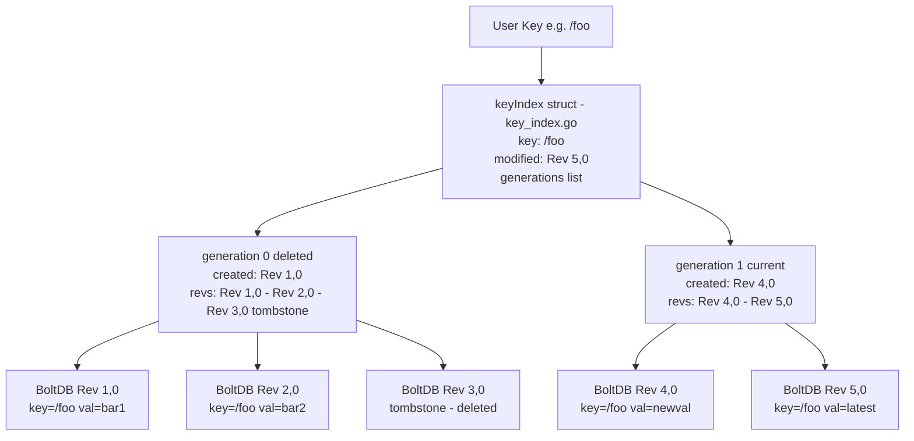

### How a `Put` Becomes a Revision

1. `kvstore.Put()` → acquires `revMu` write lock, increments `currentRev`.
2. Calls `batchTx.UnsafeSeqPut("key", revBytes, kvBytes)` — writes the encoded `KeyValue` into BoltDB's in-memory buffer.
3. Calls `index.Put(key, revision)` — updates the in-memory B-Tree `keyIndex`.
4. On `batchTx.Commit()` (triggered by the backend interval timer), the buffer is flushed to BoltDB pages and `fsync`'d.

### How a `Get` Resolves a Key

1. `kvstore.Range()` → calls `index.Get(key, atRev)` on the B-Tree.
2. The B-Tree returns the matching `Revision` (latest, or historical if `atRev` is specified).
3. `batchTx.UnsafeRange("key", revKey, ...)` reads from BoltDB (or the in-memory buffer if not yet flushed).

---

## 8. BoltDB Backend & Batching

Writing directly to BoltDB on every client request would be prohibitively slow — BoltDB takes an exclusive write lock and `fsync`s the file on every commit. The [`backend.go`](server/storage/backend/backend.go) layer solves this with batched transactions.

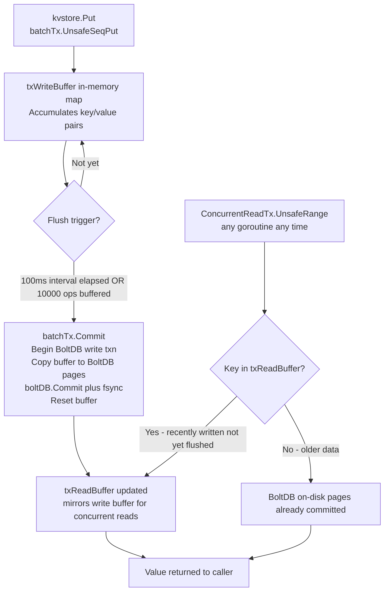

### Key Types in the Backend

| Type               | File           | Role                                         |
| ------------------ | -------------- | -------------------------------------------- |
| `backend`          | `backend.go`   | Owns the `bolt.DB`, runs the commit loop     |
| `batchTxBuffered`  | `batch_tx.go`  | Accumulates writes in `txWriteBuffer`        |
| `readTx`           | `read_tx.go`   | Standard read tx — locks during writes       |
| `ConcurrentReadTx` | `read_tx.go`   | Non-blocking read — uses buffered snapshot   |
| `txReadBuffer`     | `tx_buffer.go` | Sorted in-memory bucket map for fast lookups |

The `ConcurrentReadTx` is the critical path for etcd's linearizable reads: it merges the on-disk BoltDB data with the still-in-flight write buffer so readers always see the latest writes without waiting for a flush.

---

## 9. Leases

A **Lease** groups keys under a single TTL. When the lease expires, all attached keys are automatically deleted. This is the primitive powering Kubernetes pod health registration and distributed locks.

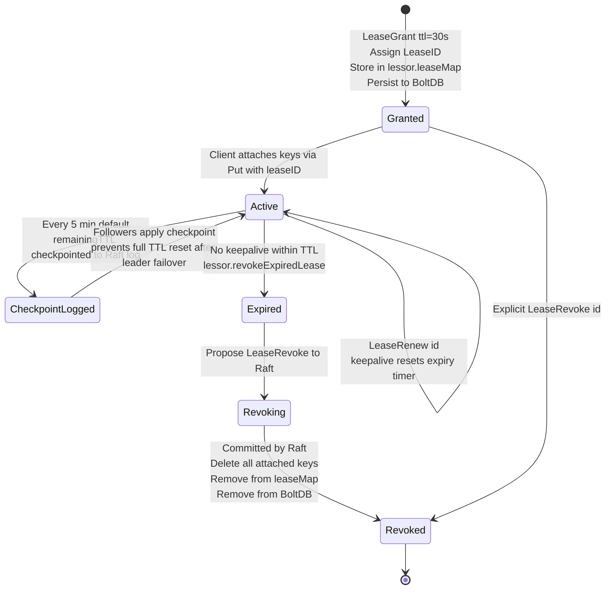

### The Lease Expiry Loop

[`lessor.go`](server/lease/lessor.go) runs a background goroutine (`runLoop`) that:

1. Every `500ms`, iterates the `leaseExpiredNotifier` min-heap (ordered by expiry time).
2. Identifies all leases where `expiry <= now`.
3. Batches up to `defaultLeaseRevokeRate` (1000/sec) into a `LeaseRevoke` proposal and proposes it to Raft.
4. The Raft-committed revoke triggers the MVCC `TxnDelete` to remove all keys with that `LeaseID`.

### Lease Checkpointing

Without checkpointing, a leader failover would reset all lease TTLs to their original values (because the new leader only knows the grant time, not elapsed time). The **checkpoint** mechanism periodically logs the `remainingTTL` to the Raft log so followers track elapsed time correctly.

---

## 10. Watches

Watches allow clients to receive a streaming gRPC notification for every mutation on a key or key-range, starting from any historical revision. The implementation is in [`watchable_store.go`](server/storage/mvcc/watchable_store.go).

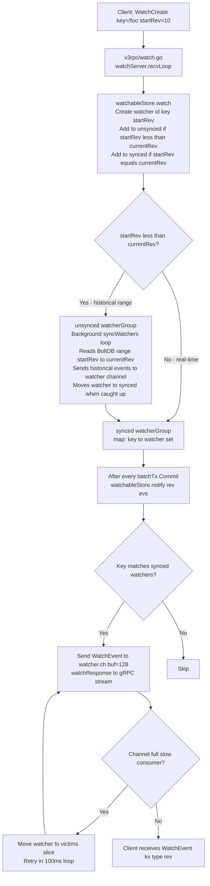

### Watcher Groups

| Group      | Description                                                                     |
| ---------- | ------------------------------------------------------------------------------- |
| `synced`   | Watchers that have caught up — notified inline on every commit via `notify()`   |
| `unsynced` | Watchers catching up from a historical revision — drained by `syncWatchersLoop` |
| `victims`  | Synced watchers whose channel was full; retried every `100ms`                   |

The `syncWatchersLoop` goroutine runs every `100ms` to drain the unsynced group and retry victims, ensuring no watcher is permanently blocked by a slow consumer.

---

## 11. Compaction

Since every write creates a new revision and old revisions are never overwritten, the BoltDB file would grow unboundedly. **Compaction** deletes all revisions below a target revision, reclaiming disk space.

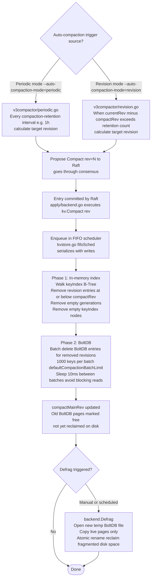

### Compaction vs Defrag

- **Compaction** removes logical entries from the B-Tree and BoltDB, but BoltDB's free-list still holds the now-empty pages — the **file size does not shrink on disk**.
- **Defrag** (`Defrag()` in [`backend.go`](server/storage/backend/backend.go)) rewrites the entire BoltDB file to a new file containing only live pages, then atomically replaces the original. This **physically reclaims disk space**.

---

## 12. Authentication & RBAC

When auth is enabled, every gRPC request is intercepted before reaching the MVCC layer. The implementation lives in [`auth/store.go`](server/auth/store.go).

### Auth Request Flow

```
Client request (with token header)
    ↓
gRPC interceptor (v3_server.go)
    ↓
AuthStore.IsAdminPermitted() or AuthStore.IsRangePermitted()
    ↓
Checks user → role → permission for the specific key range
    ↓
Allowed → continue to MVCC
Denied  → return ErrPermissionDenied
```

### Token Types

| Type             | Config flag           | Notes                                                                  |
| ---------------- | --------------------- | ---------------------------------------------------------------------- |
| **Simple Token** | `--auth-token=simple` | Stateful opaque string, stored in memory; invalidated on leader change |
| **JWT**          | `--auth-token=jwt`    | Stateless, cryptographically signed; survives leader failovers         |

### RBAC Model

| Entity         | Description                                                       |
| -------------- | ----------------------------------------------------------------- |
| **User**       | Has a password (bcrypt hashed) and a set of roles                 |
| **Role**       | Has a list of `Permission` entries                                |
| **Permission** | `{PermType: READ/WRITE/READWRITE, Key: string, RangeEnd: string}` |

The `root` user has implicit admin access. The `root` role grants full access to all keys. Auth metadata (users, roles, enabled flag) is persisted in BoltDB under the `auth` bucket, replicated through Raft like all other data.

---

## 13. Cluster Membership & ConfChange

Adding or removing nodes in a distributed system is dangerous because it changes the quorum size. etcd handles this safely via Raft's `ConfChange` mechanism, managed by [`membership/cluster.go`](server/etcdserver/api/membership/cluster.go).

### Membership Change Lifecycle

| Phase              | Description                                                                                                                                                                  |
| ------------------ | ---------------------------------------------------------------------------------------------------------------------------------------------------------------------------- |
| **Add as Learner** | New node is added with `MemberAddAsLearner`. It receives all log entries from the leader but does **not** vote in elections — it cannot affect quorum.                       |
| **Catch-up**       | The learner replays gigabytes of WAL history without stalling the leader or blocking commits.                                                                                |
| **Promote**        | Once the learner's `appliedIndex` is within `DefaultSnapshotCatchUpEntries` (5000) of the leader's commit index, it is promoted to a full voting member via `MemberPromote`. |
| **Remove**         | `MemberRemove` proposes a `ConfChangeRemoveNode` to Raft; once committed, the node is excluded from quorum calculations.                                                     |

### Two-Phase ConfChange (Joint Consensus)

etcd v3.5+ uses **joint consensus** (two `ConfChangeV2` entries) for membership changes:

1. **Phase 1** — Enter the joint configuration (both old and new quorums must agree).
2. **Phase 2** — Leave the joint configuration (switch to the new configuration).

This prevents the split-brain window that exists in single-phase membership changes.

---

## 14. Corruption Detection

etcd provides a built-in corruption detection mechanism in [`corrupt.go`](server/etcdserver/corrupt.go) to detect and alarm on data divergence between cluster members.

### Detection Modes

| Mode                 | Trigger          | Mechanism                                                              |
| -------------------- | ---------------- | ---------------------------------------------------------------------- |
| **InitialCheck**     | On startup       | Hash the entire BoltDB at the current revision; compare with all peers |
| **PeriodicCheck**    | Every 5 minutes  | Hash a recent revision; compare with a randomly selected peer          |
| **CompactHashCheck** | After compaction | Compare hashes at compacted revisions across all peers                 |

### Corruption Check Flow

```
CorruptionChecker.PeriodicCheck()
    ↓
mvcc.HashByRev(rev) → CRC32 of all BoltDB key-value pairs at that revision
    ↓
PeerHashByRev(rev) → HTTP call to each peer's /members/hash endpoint
    ↓
Compare local hash with peer hashes
    ↓
Mismatch → TriggerCorruptAlarm(memberID)
         → etcd enters CORRUPT alarm state
         → All writes rejected until operator intervenes
```

The `HashStorage` interface in [`mvcc/hash.go`](server/storage/mvcc/hash.go) computes a CRC32 hash by iterating all BoltDB key-value pairs up to a given revision in sorted order. Any divergence — even a single bit — will be caught.

---

## 15. Fan-Out Learning Strategy

Follow this structured 6-phase approach to master the entire codebase. Each phase builds on the previous.

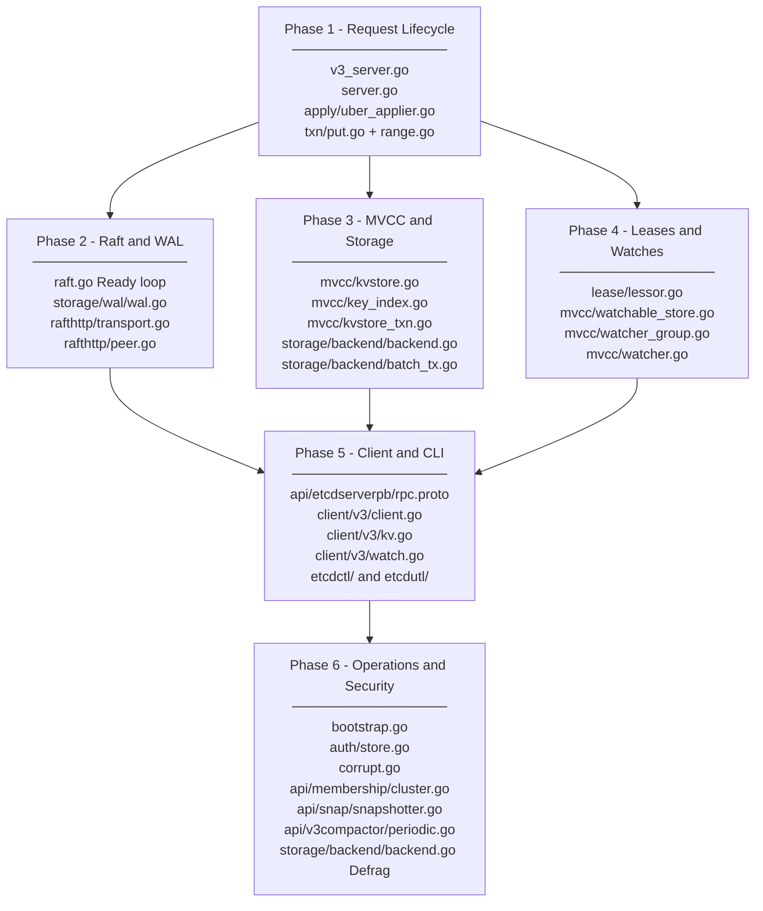

### Phase 1 — Request Lifecycle *(Start Here)*

Trace a single write end-to-end before studying any subsystem in isolation.

- [ ] Read [`v3_server.go`](server/etcdserver/v3_server.go) — how `Put`, `Range`, `Txn`, `LeaseGrant` are received as gRPC calls and proposed to Raft.
- [ ] Understand `raftRequest()` and `processInternalRaftRequestOnce()` — how proposals are serialized and the goroutine waits for commit.
- [ ] Read `applyAll()` and `applyEntries()` in [`server.go`](server/etcdserver/server.go) — how committed log entries trigger the apply chain.
- [ ] Trace [`apply/uber_applier.go`](server/etcdserver/apply/uber_applier.go) — the apply dispatch chain (quota → auth → backend).
- [ ] Read [`txn/put.go`](server/etcdserver/txn/put.go), [`txn/range.go`](server/etcdserver/txn/range.go), [`txn/txn.go`](server/etcdserver/txn/txn.go) — individual operation handlers.

### Phase 2 — Raft & WAL

- [ ] Study [`raft.go`](server/etcdserver/raft.go) — the `start()` goroutine, `Ready()` consumption, leader vs. follower disk/network ordering (lines 237-320).
- [ ] Read [`storage/wal/wal.go`](server/storage/wal/wal.go) — `Create()`, `Open()`, `Save()`, `SaveSnap()`, `Release()`.
- [ ] Inspect [`rafthttp/transport.go`](server/etcdserver/api/rafthttp/transport.go) and [`peer.go`](server/etcdserver/api/rafthttp/peer.go) — how Raft messages are sent over HTTP/2 streams.

### Phase 3 — MVCC & Storage Engine

- [ ] Read [`mvcc/kv.go`](server/storage/mvcc/kv.go) — the `KV`, `WatchableKV`, `TxnWrite` interfaces.
- [ ] Examine [`mvcc/key_index.go`](server/storage/mvcc/key_index.go) — `keyIndex`, `generation`, tombstones, compaction interactions.
- [ ] Trace [`mvcc/kvstore.go`](server/storage/mvcc/kvstore.go) and [`kvstore_txn.go`](server/storage/mvcc/kvstore_txn.go) — how `Put`/`Range` translate to BoltDB revision lookups.
- [ ] Read [`storage/backend/backend.go`](server/storage/backend/backend.go) and [`batch_tx.go`](server/storage/backend/batch_tx.go) — the batch commit loop and `txReadBuffer`.

### Phase 4 — Leases & Watches

- [ ] Study [`lease/lessor.go`](server/lease/lessor.go) — `Grant()`, `Renew()`, `Revoke()`, the expiry heap, `runLoop()`, and lease checkpointing.
- [ ] Read [`mvcc/watchable_store.go`](server/storage/mvcc/watchable_store.go) — `watch()`, `notify()`, `syncWatchers()`, victim handling.
- [ ] Study [`mvcc/watcher_group.go`](server/storage/mvcc/watcher_group.go) — the interval tree for range watches and the `watcherGroup` structure.

### Phase 5 — Client Libraries & CLI Tools

- [ ] Read the API contract in [`api/etcdserverpb/rpc.proto`](api/etcdserverpb/rpc.proto) — the canonical definition of all gRPC services.
- [ ] Study [`client/v3/client.go`](client/v3/client.go) — connection management, retry policy, and credential handling.
- [ ] Browse [`client/v3/kv.go`](client/v3/kv.go) and [`watch.go`](client/v3/watch.go) — how the SDK implements the `KV` and `Watcher` interfaces on top of gRPC streams.
- [ ] Explore [`etcdctl/`](etcdctl/) and [`etcdutl/`](etcdutl/) — CLI command handlers and how they use the client SDK.

### Phase 6 — System Operations *(Advanced)*

- [ ] Read [`bootstrap.go`](server/etcdserver/bootstrap.go) — all startup paths: new cluster, WAL recovery, snapshot restore.
- [ ] Study [`auth/store.go`](server/auth/store.go) — user/role CRUD, RBAC permission checks, JWT vs simple token issuance.
- [ ] Study [`corrupt.go`](server/etcdserver/corrupt.go) — hash-based corruption detection, peer comparison, alarm triggering.
- [ ] Read [`api/membership/cluster.go`](server/etcdserver/api/membership/cluster.go) — learner promotion, joint consensus ConfChange.
- [ ] Read [`api/snap/snapshotter.go`](server/etcdserver/api/snap/snapshotter.go) — how `.snap` files are written and loaded.
- [ ] Study [`api/v3compactor/periodic.go`](server/etcdserver/api/v3compactor/periodic.go) and [`revision.go`](server/etcdserver/api/v3compactor/revision.go) — auto-compaction modes.
- [ ] Study `Defrag()` in [`storage/backend/backend.go`](server/storage/backend/backend.go) — physical disk space reclamation.

---

*Last updated to reflect the etcd v3.5+ codebase. All file paths are relative to the repository root.*
