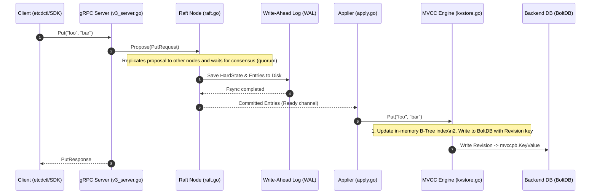
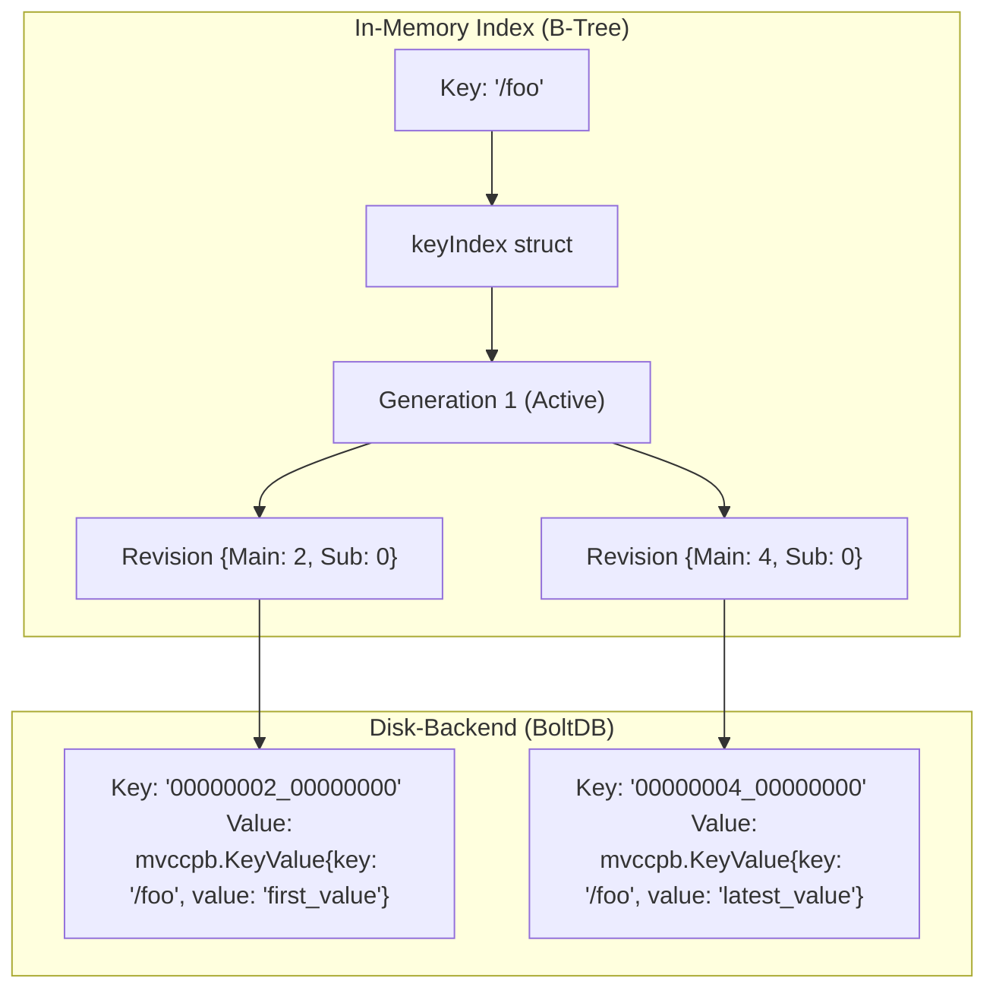

# The Absolute Beginner's Guide to etcd: Architecture, Code, and Learning Strategy

Welcome to the `etcd` repository! This document is designed to give you a complete, bottom-up mental model of `etcd`—from its high-level distributed systems concepts down to the actual Go packages, structs, and code paths. 

At the end of this guide, you will find a structured, step-by-step **Fan-Out Learning Strategy** to help you master this codebase at your own pace.

---

## 1. What is etcd? (The Core Analogy)

Imagine a bank with three branch managers. To keep things safe, each manager has a copy of the bank's master database (account balances). However, to prevent fraud:
1. They must agree on every deposit or withdrawal before updating their ledger.
2. If one manager goes offline, the other two can still agree (majority/quorum).
3. If a customer asks any manager for their balance, that manager must ensure they aren't giving stale information by checking with the others.

**etcd is that shared, consistent ledger.** 
- It is a **distributed, strongly consistent key-value store**.
- It is used primarily by orchestration systems like Kubernetes to store critical cluster state (e.g., "which container is running on which node?").
- Consistency means every read returns the most recent write, or an error. There is no "eventual consistency" here.

---

## 2. The Big Picture: Architecture & Data Flow

When a client performs a write, say `Put("foo", "bar")`, here is how it flows through `etcd`:



### Flow Breakdown:
1. **The gRPC Layer**: The client makes a call to the gRPC endpoint. [v3_server.go](server/etcdserver/v3_server.go#L295) receives the request and wraps it in a proposal.
2. **Raft Proposal**: The server proposes this write to its local Raft consensus engine.
3. **Consensus**: Raft replicates this command to peer servers. Once a majority (quorum) of servers acknowledge it, the entry is marked as **committed**.
4. **WAL (Write-Ahead Log)**: The node immediately writes the committed entry to its append-only WAL file on disk. This guarantees durability if the server crashes.
5. **Applier**: The local server consumes the committed log entries from Raft's `Ready()` channel and runs the apply loop.
6. **MVCC Storage**: The applier writes the data to the Multi-Version Concurrency Control (MVCC) store.
7. **BoltDB**: The MVCC store writes the serialized key-value pair into BoltDB (a simple B+ tree database on disk).
8. **gRPC Response**: Once the write is finalized, the gRPC handler wakes up and returns success to the client.

---

## 3. The Nuts & Bolts: Directory Map & Repo Structure

The `etcd` repository is organized as a modular Go workspace. Here is the visual tree of the key packages and files, followed by a breakdown of **which files sit where, and why**.

### Visual Directory Tree

```
etcd/ (Root Workspace)
├── go.work                           # Manages multiple Go modules in the workspace
├── api/                              # Module: Protobuf & gRPC interfaces
│   └── etcdserverpb/
│       ├── rpc.proto                 # API service definitions (KV, Watch, Lease, etc.)
│       └── raft_internal.proto       # Proto schema for internal Raft logs
├── client/                           # Client SDK modules
│   └── v3/                           # Module: official Go Client SDK
│       ├── client.go                 # Client initialization & credentials
│       ├── kv.go                     # Implements client KV methods (Put, Get, Txn)
│       └── watch.go                  # Implements Watch client streams
├── etcdctl/                          # CLI tool for clients
│   └── main.go                       # Entrypoint for command-line tool
├── etcdutl/                          # Offline admin tool
│   └── main.go                       # Entrypoint for admin snapshots & DB defrags
└── server/                           # Module: Core Server Engine
    ├── main.go                       # Standard executable entrypoint (invokes etcdmain)
    ├── etcdmain/                     # Command-line parsing & startup bootstrapping
    ├── etcdserver/                   # Main etcd server orchestration
    │   ├── server.go                 # Core server loop & apply dispatcher
    │   ├── raft.go                   # Bridges etcdserver with go.etcd.io/raft consensus
    │   ├── v3_server.go              # Implements the gRPC service endpoints
    │   ├── apply/
    │   │   ├── apply.go              # Marshals entries & dispatches to the correct applier
    │   │   └── backend.go            # Evaluates requests against MVCC & Lease engine
    │   └── txn/
    │       ├── put.go                # Applies individual Put operations
    │       ├── range.go              # Applies Range/Get operations
    │       └── txn.go                # Coordinates Multi-operation Transactions
    ├── lease/                        # Ephemeral TTL & Lease management
    │   ├── lessor.go                 # The Lessor manager engine
    │   └── lease.go                  # Model for a single Lease
    └── storage/                      # Storage Engines
        ├── wal/                      # Write-Ahead Logging
        │   └── wal.go                # Append-only journal for raft log replication
        ├── backend/                  # Persistent database wrapper
        │   └── backend.go            # Scheduled transaction batcher for BoltDB
        └── mvcc/                     # Multi-Version Concurrency Control (revisions)
            ├── kvstore.go            # High-level MVCC coordinator
            ├── key_index.go          # In-memory B-Tree index (Key -> Revisions)
            └── watchable_store.go    # Hook for client watch subscriptions
```

---

### Which File Sits Where, and Why?

#### 1. The API Module (`/api/`)
* **[rpc.proto](api/etcdserverpb/rpc.proto)**
  * *Why here:* To decouple client/server contracts from internal implementations. Because this defines the exact gRPC API structure, both the client SDK (`client/v3`) and the server engine (`server`) reference this single source of truth.
* **[raft_internal.proto](api/etcdserverpb/raft_internal.proto)**
  * *Why here:* Defines the wrapper messages (like `InternalRaftRequest`) used when pushing operations through Raft. It belongs here because it dictates the serialization standard of the entries stored inside WAL files and sent across nodes.

#### 2. The Client SDK Module (`/client/v3/`)
* **[client.go](client/v3/client.go)**
  * *Why here:* Serves as the developer entrance to the client SDK. It manages network dialing, gRPC retry interceptors, and credentials, acting as a gateway to KV, Watch, and Lease subsystems.
* **[kv.go](client/v3/kv.go)** & **[watch.go](client/v3/watch.go)**
  * *Why here:* Keeps the developer-facing SDK files segregated by concern. `kv.go` handles standard CRUD methods, while `watch.go` manages long-running HTTP/2 stream multiplexing for real-time notifications.

#### 3. Core Server Engine Modules (`/server/`)
* **[server/main.go](server/main.go)**
  * *Why here:* The wrapper executable target. It does not contain server business logic; it merely pulls in the bootstrapper `etcdmain` and runs it.
* **[server/etcdserver/server.go](server/etcdserver/server.go)**
  * *Why here:* This is the orchestrator. It manages the server's state, coordinates cluster membership, triggers snapshots, and processes local progress. It sits at this level because it needs to access Raft, the Storage Engine, and the Leases layer concurrently.
* **[server/etcdserver/raft.go](server/etcdserver/raft.go)**
  * *Why here:* Connects the server to the external `go.etcd.io/raft` library. It drives the consensus loop (`Ready()`), coordinates RPCs to send to peers, and hands off committed blocks to the apply loop.
* **[server/etcdserver/v3_server.go](server/etcdserver/v3_server.go)**
  * *Why here:* Implements the gRPC APIs defined in `rpc.proto`. It acts as the gatekeeper, receiving client requests, verifying authorization, proposing them to Raft, and waiting for the write to commit.
* **[server/etcdserver/apply/apply.go](server/etcdserver/apply/apply.go)**
  * *Why here:* Decouples entry retrieval from execution. When a node commits an entry, `apply.go` marshals the raw bytes into Go structs, checks permissions and quotas, and routes them to the underlying storage applier.
* **[server/etcdserver/txn/put.go](server/etcdserver/txn/put.go)** & **[range.go](server/etcdserver/txn/range.go)**
  * *Why here:* Splits execution logic. Keeping `Put`, `Range` (Get), and `Txn` logic separated makes modifying transaction behavior modular and isolates them from the general server lifecycle code.

#### 4. The Lease Module (`/server/lease/`)
* **[lessor.go](server/lease/lessor.go)**
  * *Why here:* The lessor manager engine. It handles creating leases and runs a background loop to automatically expire lease-bound keys. It is a standalone package because both the MVCC storage engine (to clean up keys) and the gRPC handlers need access to it.

#### 5. Storage Engines (`/server/storage/`)
* **[server/storage/wal/wal.go](server/storage/wal/wal.go)**
  * *Why here:* Handles Write-Ahead Logging. Before any write is applied to the state machine, it must be recorded on disk. `wal.go` implements fast sequential file appending and syncs data to disk (`fsync`) for disaster recovery.
* **[server/storage/backend/backend.go](server/storage/backend/backend.go)**
  * *Why here:* Serves as a transactional scheduler over BoltDB. Standard BoltDB locks during commits; `backend.go` batches writes to run concurrently and caches reads via buffers to maximize performance.
* **[server/storage/mvcc/kvstore.go](server/storage/mvcc/kvstore.go)**
  * *Why here:* High-level coordinator of the Multi-Version Concurrency Control engine. It bridges backend transactions and the in-memory index.
* **[server/storage/mvcc/key_index.go](server/storage/mvcc/key_index.go)**
  * *Why here:* Houses the in-memory B-Tree index definitions (`keyIndex` and `generation`). It is situated under the `mvcc` directory because this index is an implementation detail of the multi-version storage design (mapping keys to historical revisions).
* **[server/storage/mvcc/watchable_store.go](server/storage/mvcc/watchable_store.go)**
  * *Why here:* Extends the basic key-value store with notification triggers. It intercepts database updates on transaction commit and routes events to active Watch streams.

---

## 4. Deep Dives: Key Concepts

### A. How MVCC (Multi-Version Concurrency Control) Works
In a standard SQL database, updating a key overwrites the old value. If another client is reading while you write, they might get partial data, or you have to block them using locks.

`etcd` avoids locks for readers using **revisions**:
- Every write increments a global counter called the **Revision** (e.g., Revision 1, Revision 2, etc.).
- Old values are **never overwritten**. Instead, a new version of the key is saved under the new revision.
- Because old revisions are kept, readers can read the database as it looked at a specific historical point (e.g., "Give me the value of `/foo` at Revision 4").

#### The B-Tree Index vs. BoltDB
BoltDB is a key-value store, but its keys are **not** the user keys (like `/foo`). 
Instead:
- **BoltDB keys** are the **Revision numbers** (e.g. `Revision {Main: 4, Sub: 0}`).
- **BoltDB values** are the marshaled `mvccpb.KeyValue` protobufs (which contain the actual key `/foo` and value `bar`).
- To find a key by its name, etcd keeps an **in-memory B-Tree index** (`kvindex`). 
  The index maps user keys (e.g. `/foo`) to a `keyIndex` struct that holds the history of revisions for that key.



### B. Compaction
Since revisions are kept forever, the database would eventually run out of disk space.
To prevent this, etcd supports **Compaction**. Compaction deletes history before a given revision, freeing up disk space in BoltDB.

### C. Leases
A **Lease** allows a client to group keys together under a single lifetime.
- When a lease expires (e.g., the client failed to send a keepalive heart-beat due to network outage), etcd automatically deletes all keys bound to that lease.
- This is incredibly useful for service discovery and distributed locks (e.g. "I am alive; if I disappear, delete my lock").

### D. Watches
A client can open a streaming gRPC connection to **Watch** a key or a range of keys.
- Every time a transaction updates a watched key, the MVCC watchable store (`watchable_store.go`) catches it and sends the revision update down the gRPC stream to the client.
- The client can also watch from a historical revision (e.g. "Watch for all changes since Revision 10").

---

## 5. Structured Fan-Out Learning Strategy

To learn every nut and bolt of `etcd`, follow this 6-phase fan-out strategy:

```
                  ┌──────────────────────────────┐
                  │ Phase 1: Request Lifecycle   │
                  └──────────────┬───────────────┘
                                 │
         ┌───────────────────────┼───────────────────────┐
         ▼                       ▼                       ▼
┌─────────────────┐     ┌─────────────────┐     ┌─────────────────┐
│ Phase 2: Raft   │     │ Phase 3: MVCC & │     │ Phase 4: Leases │
│ & Consensus     │     │ Storage Engine  │     │ & Watches       │
└─────────────────┘     └─────────────────┘     └─────────────────┘
         │                       │                       │
         └───────────────────────┼───────────────────────┘
                                 │
                                 ▼
                  ┌──────────────────────────────┐
                  │ Phase 5: Client & Utilities  │
                  └──────────────┬───────────────┘
                                 │
                                 ▼
                  ┌──────────────────────────────┐
                  │ Phase 6: System Operations   │
                  └──────────────────────────────┘
```

### Phase 1: Request Lifecycle (Start Here)
Trace how a single write is accepted and executed.
- [ ] Read [v3_server.go](server/etcdserver/v3_server.go) to see how client requests are received.
- [ ] Understand `raftRequest` and how entries are proposed.
- [ ] Look at `applyAll` and `applyEntries` in [server.go](server/etcdserver/server.go#L972) to see how committed logs trigger changes.
- [ ] See how [apply.go](server/etcdserver/apply/apply.go) unpacks the request and dispatches it.

### Phase 2: Raft Consensus & Integration
Learn how the node communicates with the cluster to keep logs identical.
- [ ] Study [raft.go](server/etcdserver/raft.go) to see how the raft node loop (`Ready()`) handles ticks, snapshots, and replication messages.
- [ ] Inspect how WAL files are written in [server/storage/wal](server/storage/wal) to guarantee disk durability before consensus.

### Phase 3: MVCC & Storage Engine
Learn how etcd provides transactional consistency and maintains historical revision data on top of BoltDB.
- [ ] Read the definition of `KV` and `TxnWrite` in [kv.go](server/storage/mvcc/kv.go).
- [ ] Examine [key_index.go](server/storage/mvcc/key_index.go) to see how in-memory key-to-revision mappings and key generations are implemented.
- [ ] Trace `kvstore.go` and `kvstore_txn.go` in [server/storage/mvcc](server/storage/mvcc) to see how reads/writes translate to BoltDB operations.
- [ ] Read [backend.go](server/storage/backend/backend.go) to see how etcd buffers and schedules transaction batching to BoltDB.

### Phase 4: Leases & Watches
Understand ephemeral data and real-time streaming updates.
- [ ] Study [lessor.go](server/lease/lessor.go) to see how leases are granted, updated, and revoked, and how the lessor runs a background thread to find expired leases.
- [ ] Read [watchable_store.go](server/storage/mvcc/watchable_store.go) and [watcher.go](server/storage/mvcc/watcher.go) to learn how the watch stream triggers when transactions commit.

### Phase 5: Client Libraries & CLI Tools
Understand how external applications and operators talk to the engine.
- [ ] Check out the API contract protocols in [api/etcdserverpb/rpc.proto](api/etcdserverpb/rpc.proto).
- [ ] Look at [client/v3/client.go](client/v3/client.go) to understand the official SDK implementation.
- [ ] Browse the CLI handlers in [etcdctl](etcdctl) and [etcdutl](etcdutl).

### Phase 6: System Operations (Advanced)
Study how etcd maintains health, recovery, and cluster membership.
- [ ] Look at the cluster membership logic in [server/etcdserver/api/membership/](server/etcdserver/api/membership).
- [ ] Read [bootstrap.go](server/etcdserver/bootstrap.go) to see how etcd starts up, recovers from snapshot/WAL, and discovers peers.
- [ ] Study the database defragmentation (`Defrag()`) process in [backend.go](server/storage/backend/backend.go#L69).
